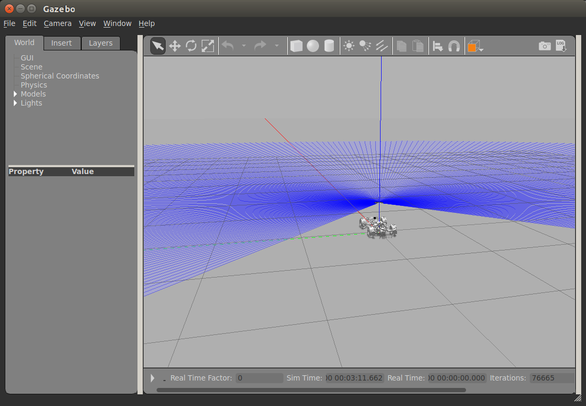

# Running simulation in Docker for Erle Robotics vehicles

This repository contains scripts and instructions on building Docker container for the purpose of running simulations with [Erle Robotics](http://erlerobotics.com/) vehicles. It is essentially dockerized instructions provided on the official  [Erle Robotics website](http://docs.erlerobotics.com/simulation). Currently only ROS Indigo is supported and tested, Kinetic is in the works.

## Building Docker image
To build a Docker container, run the following command from this directory:
```sh
docker build -t erle-sim:indigo -f Dockerfile.indigo .
```
This command will create a Docker image with the tag ```erle-sim:indigo```. Once the build is finished, you can verify that the image is built by running ```docker images``` command.

## Creating Docker container
In order to be able to run Gazebo from the Docker container, you need to connect host's X server to the Docker container. A good tutorial on various methods is documented on the [ROS Wiki](http://wiki.ros.org/docker/Tutorials/GUI), here we use the most simple (and insecure!) way.
1. Create Docker container:
    ```sh
    docker run -it --network=host -v /tmp/.X11-unix:/tmp/.X11-unix -e DISPLAY=unix${DISPLAY} --name=erle-sim erle-sim:indigo bash
    ```
    This command will create a container named ```erle-sim``` from the image with the same name (```erle-sim```) and enable executing GUI programs.
2. Exit the container and restart/attach the container granting the permissions to xhost first:
    ```sh
    xhost +local:`docker ps -aqf "name=erle-sim"`
    docker start erle-sim && docker attach erle-sim
    ```
    Replace ```erle-sim``` with your container name if needed.
3. Run Gazebo to make sure everything is working:
    ```sh
    gazebo
    ```
    You should see Gazebo window.
### Troubleshooting
In case you see messages like ```failed to load driver``` while executing step 3 **and** no Gazebo window opens up, you might be missing drivers. The current Docker script already contains command that installs Mesa drivers (```libgl1-mesa-dri```) but that might not be enough so try googling for more information.
## Testing
Once the container is created, try running simulator. For example, to run Rover simulator, run the following commands from the container:
```sh
source ~/simulation/ros_catkin_ws/devel/setup.bash
cd ~/simulation/ardupilot/APMrover2/
../Tools/autotest/sim_vehicle.sh -j 4 -f Gazebo
# once MAVProxy has launched completely, load the parameters
param load /[full_path_to_your_home_directory]/simulation/ardupilot/Tools/Frame_params/3DR_Rover.param
# For example: param load /root/simulation/ardupilot/Tools/Frame_params/3DR_Rover.param
```
Now connect another terminal to the currently running Docker container:
```sh
docker exec -it erle-sim bash
```
and run the following commands: 
```sh
source ~/simulation/ros_catkin_ws/devel/setup.bash
roslaunch ardupilot_sitl_gazebo_plugin rover_spawn.launch
```
If everything was setup correctly, you should see Gazebo window with Rover model that you can control from the first terminal using MAVProxy commands:

Some of the MAVProxy commands are described [here](http://docs.erlerobotics.com/simulation/vehicles/erle_rover/tutorial_1).
You can also use ```run_erle_sim.sh``` script to create new container or attach to a running container.